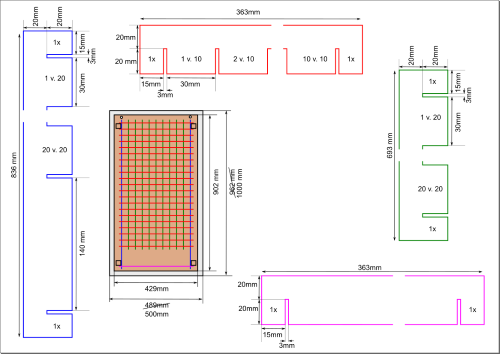
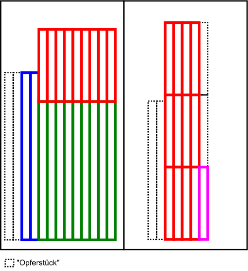
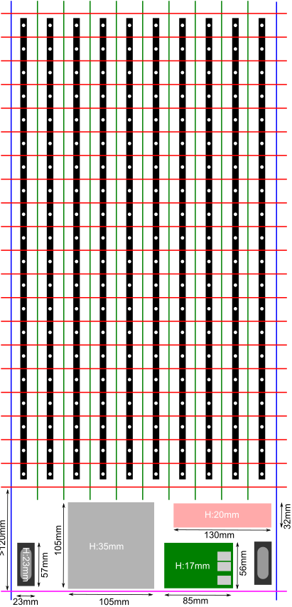
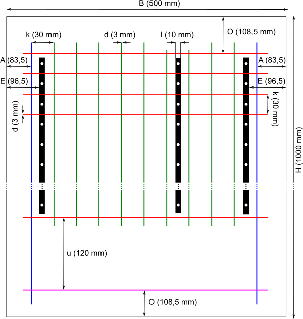
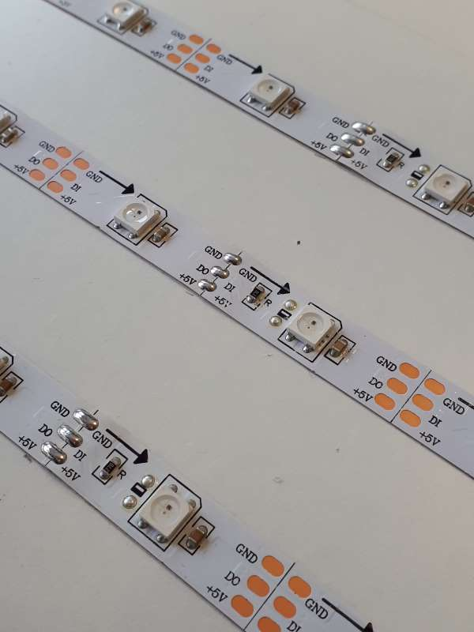
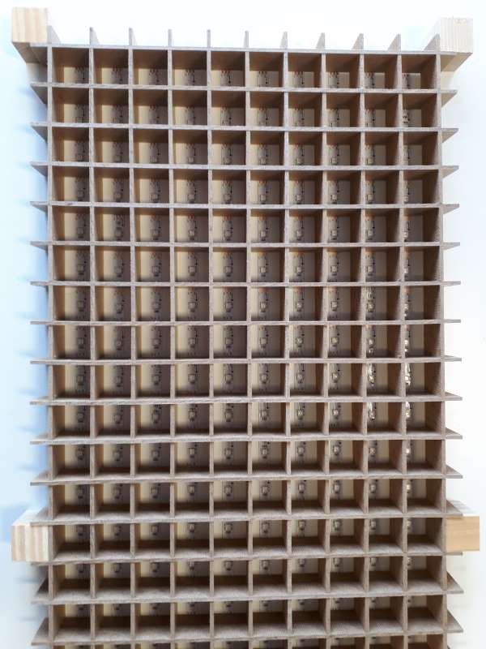
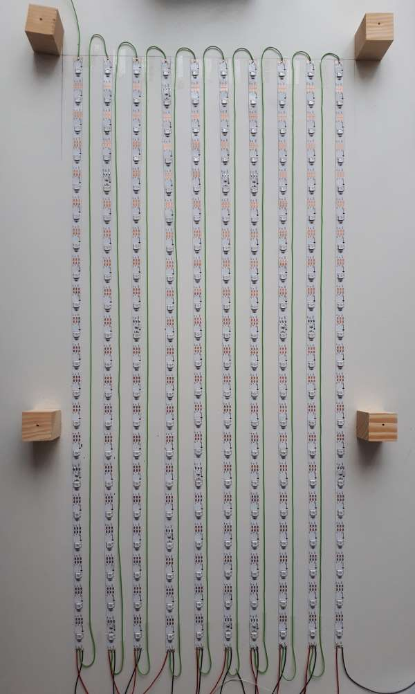
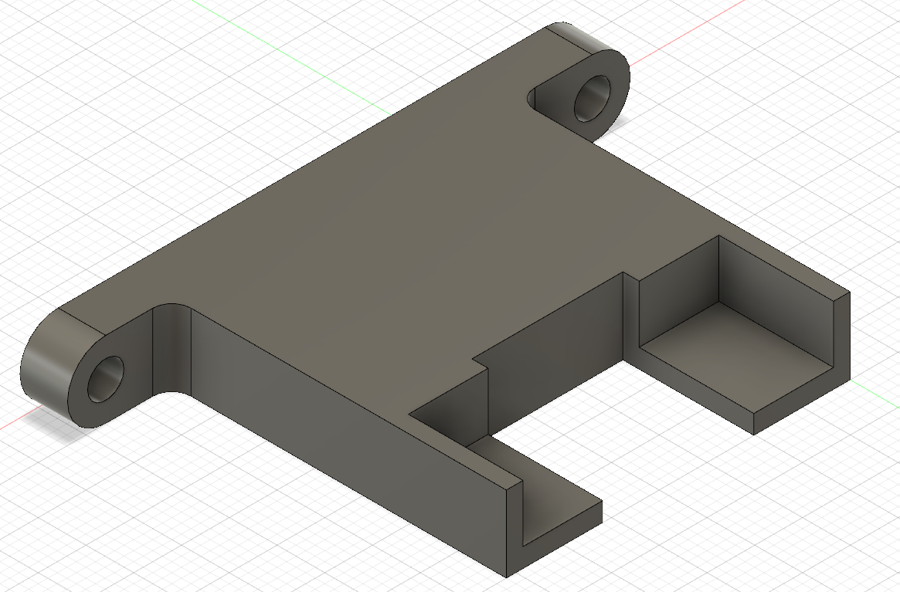
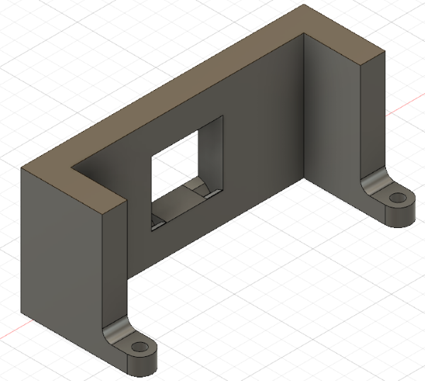

# Hardware

## Übersicht

Folgende Hardware wird benötigt:

* Raspberry Pi 3+ mit WLAN, der die Steuerung der Hardware übernimmt
* Micro-SD-Karte für den Raspberry
* 4x64 LED Matrix-Display, auf der die Punktzahl sowie ggf. andere Information dargestellt werden kann
* LED-Streifen vom Typ WS2812, bei dem jede LED einzeln angesteuert werden kann
* USB-Soundkarte (da der für Musik benötigte Timer zur Ansteuerung der WS2812 bereits in Verwendung ist)
* leistungsfähiges 5V-Netzteil
* Verbindungsklemmen
* Lautsprecher
* Audio-Verstärker
* 230V-Netzschalter
* Flachsteckerhülsen zur Verkabelung des Netzschalters
* diverse Kabel
* MDF-Platten
* eine Milchglasscheibe
* eine Holzplatte
* diverses Befestigungsmaterial

Details und Bezugsquellen sind weiter unten aufgelistet.

Folgendes Werkzeug wird benötigt:

* Kreissäge mit Kreissägeblatt in 3mm Stärke (gleiche Stärke wie die MDF Platte) und Anschlag
* Krimpzange für Kabelschuhe und Flachsteckerhülsen
* Bohrmaschine und Bohrer
* Lötstation
* Schraubendreher

## Kosten

Die Kosten sind bei diesem Projekt nicht zu vernachlässigen. Ungefähre Kostenübersicht:

* 36 € Raspberry Pi 3B+
* 5 € Micro-SD-Karte 16 GB
* 7 € 4x64 LED Matrix
* 70 € 7 Meter WS2812 LED Streifen, 30 LEDs/m
* 8 € USB Soundkarte
* 20 € Netzteil
* 3 € Lautsprecher
* 10 € Audio-Verstärker
* 2 € Netzschalter
* 0,35 € Flachsteckerhülsen
* 1,50 € Kabelschuhe
* 2,50 € Verbindungsklemmen
* 3 € Kaltgerätestecker als Netzkabel
* 10 € MDF Platte 1200x600mm
* 24 € Acrylglasplatte 1000x500mm
* zzgl. Befestigungsmaterial
* zzgl. Kabel und Drähte
* zzgl. Versandkosten

In Summe kommen also knapp 210 € zusammen.

## Bezugsquellen

Raspberry Pi 3B+ (ohne Zubehör)

* [Reichelt, Art.Nr. RASPBERRY PI 3B+](https://www.reichelt.de/raspberry-pi-3-b-4x-1-4-ghz-1-gb-ram-wlan-bt-raspberry-pi-3b-p217696.html) für 35,90 €, manchmal auch 32,90 € im Angebot
* [Conrad, Best.Nr. 1668026-62](https://www.conrad.de/de/raspberry-pi-3-model-b-1-gb-ohne-betriebssystem-1668026.html) für 39,99 €

Micro SD Karte, 16 GB, Class 10

* [Reichelt, Art.Nr. INTENSO 3413470](https://www.reichelt.de/microsdhc-speicherkarte-16gb-intenso-class-10-intenso-3413470-p126587.html?&trstct=pos_4) oder vergleichbar, für 3,95 €
* [Conrad, Best.Nr. 417056-62](https://www.conrad.de/de/p/verbatim-premium-microsdhc-karte-16-gb-class-10-417056.html) oder vergleichbar, für 6,09 €

4x64 LED Matrix

* [AZ-Delivery](https://www.az-delivery.de/products/4-x-64er-led-matrix-display?ls=de) für 6,99 € (größere Mengen deutlich günstiger)

WS2812 LED Streifen, 30 LEDs/m, min. 200 LEDs, also 7 Meter.

*Hinweis*: manche LED-Streifen können nicht nach jeder LED, sondern nur nach jeder dritten LED o.ä. getrennt werden. Das ist ungünstig, weil für dieses Tetris-Spiel Längen von 20 LEDs zugeschnitten werden müssen.

* [ELV, Best.Nr. 68-117744](https://www.elv.de/diamex-5-m-rgb-led-streifen-mit-ws2812-rgb-leds-hochflexibel.html) für 44,95 €/Rolle, leider nicht als Meterware, d.h. man benötigt 2 Stück für 89,90 €
* [Watterott, Art.Nr. 20160049](https://www.watterott.com/de/WS2812-RGB-LED-Streifen-30-LEDs/m-Nicht-wasserdicht-5m) für 57,12 €, leider nicht als Meterware, d.h. man benötigt 2 Stück für 114,24 €
* [Conrad, Best.Nr. 1575776-62](https://www.conrad.de/de/thomsen-strip-5m-150-rgb-ip40-led-streifen-eek-a-a-e-mit-steckerbuchse-5-v-5-m-rgb-1575776.html) für 63,60 €, leider nicht als Meterware, d.h. man benötigt 2 Stück für 127,20 €
* [Völkner, Art.Nr. S434481](https://www.voelkner.de/products/1020908/Thomsen-STRIP-5M-150-RGB-IP40-LED-Streifen-EEK-A-A-E-mit-Stecker-Buchse-5V-5m-RGB.html) für 63,60 €, leider nicht als Meterware, d.h. man benötigt 2 Stück für 127,20 €

USB Soundkarte

*Hinweis*: USB Soundkarten sind teilweise ziemlich groß. Dadurch belegen sie dann mehrere USB-Ports. Das erschwert die Programmierung, sofern die Programmierung direkt am Raspberry Pi erfolgen soll. Zu empfehlen sind USB Soundkarten, die zunächst über ein Kabel laufen.

* [Amazon, UGreen externe Soundkarte](https://www.amazon.de/gp/product/B01N905VOY) für 8,99 €

5V Netzteil

*Hinweis*: die Bedeutung des Netzteils wird leicht unterschätzt. Das Tetris-Feld besteht aus 200 bunten LEDs, d.h. sie bestehen aus den drei Grundfarben rot, grün und blau. Jede Farbe kann mit 20mA berücksichtigt werden. Das ergibt dann bei Vollbeleuchtung 200\*3\*20mA = 12A. Die LED Matrix besitzt 4x64 (oder 8x32) LEDs in einer Farbe und brauchen daher 8\*32\*20mA = 5,1A. Der Raspberry sollte mit min. 1A berücksichtigt werden. Somit ergibt sich ein Gesamtstrom von 18A. Als Leistung ausgedrückt sind das 90W (im schlechtesten Fall).

*Warnung*: Arbeiten mit 230V Netzspannung dürfen nur von Fachpersonal durchgeführt werden. Es besteht Lebensgefahr.

* [Conrad, Best.Nr. 1439462-62](https://www.conrad.de/de/acdc-netzteilbaustein-geschlossen-mean-well-lrs-100-5-5-vdc-18-a-90-w-1439462.html) für 25,02 €

Lautsprecher, 2,5W

* [Pollin, Best.Nr. 641240](https://www.pollin.de/p/lautsprecher-set-l-r-4-ohm-2-5-w-aus-laptop-641240) für 0,95 € (es handelt sich um ein Paar)

Audio-Verstärker, 5V, 3,7W, Stereo

* [Reichelt, Art.Nr. DEBO SOUND AMP2](https://www.reichelt.de/entwicklerboards-audioverstaerker-stereo-3-7-w-klasse-d-debo-sound-amp2-p235507.html?r=1) für je 9,40 €

Netzschalter, 230V, für 4,75mm Flachstecker

* [Reichelt, Art.Nr. WIPPE 1802.1108](https://www.reichelt.de/wippschalter-2x-aus-schwarz-i-o-wippe-1802-1108-p36774.html) für 1,55 €

Flachsteckerhülsen, 4,75mm, rot (0,5-1,5mm²)

* 4 \* [Reichelt, Art.Nr. FSH-R-4,75](https://www.reichelt.de/flachsteckerhuelse-breite-4-75mm-rot-fsh-r-4-75-p7912.html) für je 0,05 €

Gabelkabelschuh, M4, rot (0,5-1,5mm²)

* 5 \* [Reichelt, Art.Nr. WE K404040HS](https://www.reichelt.de/gabelkabelschuhe-mit-schrumpfschlauch-0-5-1-5-mm-m4-rot-we-k404040hs-p189425.html?&trstct=pos_2) für je 0,33 €

Verbindungsklemmen, 5 Leiter

* 3 \* [Reichelt, Art.Nr. WAGO 221-415](https://www.reichelt.de/verbindungsklemme-5-leiteranschluss-wago-221-415-p149800.html?&trstct=pol_1) für je 0,75 €

Netzkabel, 230V, Schuko

* [Reichelt, Art.Nr. NKSK 150 SW GEW](https://www.reichelt.de/kaltgeraete-anschlusskabel-beidseitig-abgewinkelt-1-5-m-schwarz-nksk-150-sw-gew-p225301.html) für 2,80 € (oft liegen die daheim auch rum)

MDF Platte, 3mm, 1200x600mm

* lokaler Baumarkt, z.B. 2 Stück [Bauhaus, Prod.Nr 22585866](https://www.bauhaus.info/mdf-platten-spanplatten/mdf-platte/p/22585866) für 4,65 €, zusammen 9,30 €

Acrylglasplatte, 3mm, 45% Lichtdurchlässigkeit, 1000x500mm

* [Plexiglas Dekoshop, Art.Nr. WN770 45 03 Z_acrylglas_plexiglas](http://www.plexiglas-dekoshop.de/index.php?option=com_hikashop&view=product&layout=show&Itemid=682&lang=de) für 23,86 €

## Konstruktion

Für die Höhe der Zuschnitte muss die maximale Höhe der eingekauften Bauteile berücksichtigt werden. In unserem Fall hat das höchste Bauteil (das Netzteil) eine Höhe von 35mm. Um Luftzirkulation zu ermöglichen, haben wir dann eine Höhe von 40mm gewählt.

Zeichnung für den Zuschnitt der MDF-Platten ([Download SVG](Hardware/TetrisZuschnittMDF.svg))

Es werden 2 blaue, 9 grüne, 21 rote und 1 rosa Teil benötigt, die aus der MDF-Platte zugeschnitten werden müssen.

Zeichnung für die Aufteilung der Zuschnitte auf die MDF-Platten ([Download SVG](Hardware/MDFAufteilung.svg)). Die Opferstücke dienen dazu, die eigentlichen Brettchen vor Ausreißen zu schützen; d.h. sie werden beim Sägen vor und hinter die gleich langen Brettchen gelegt, um einen sauberen Schnitt zu erhalten.

Zeichnung für die Unterbringung der Hardware([Download SVG](Hardware/UnterbringungHardware.svg)).

## Spannungsversorgung

Bei der Auslegung des Netzteils wurde schon festgestellt, dass wir es mit nennenswerter Leistung zu tun haben. Diese Leistung muss auf die 10 LED Streifen à 20 LEDs verteilt werden. Pro LED-Streifen sind 20 LEDs \* 3 Farben/LED \* 20mA/Farbe, also 1,2A erforderlich.

Die VDE 0298 T4 06/13 gibt als Belastbarkeit von frei verlegten, einadrigen Adern einen Wert von 15A bei 0,75mm² an. In mehradrigen Leitungen nur 12A. Wir verlegen ggf. mehrere Adern parallel oder nah beieinander, so dass wir vorsichtshalber den niedrigeren Wert annehmen.

Für 1,2A können wir die Fläche verkleinern auf 0,75mm²/12A\*1,2A = 0,075mm². Der nächsthöhere käuflich erhältliche Wert wäre 0,08mm². Wer einen solchen Draht in der Hand hält, wird allerdings Zweifel bekommen. Selbst "normaler" Schaltdraht (Steuerleitung) hat schon 0,14mm². Außerdem ist zu beachten, dass die Verbindungsklemme auch für den Draht geeignet sein muss. Die Wago-Klemme 221-415 gibt einen Kabelquerschnitt ab 0,14mm² an.

Von 0,14mm² Schaltlitze hatten wir genügend Vorrat, so dass wir keinen extra Draht bestellt haben.

Die Drähte für die Spannungsversorgung der LED-Streifen sind ca. 20cm lang. Kupferdraht mit einem spezifischen Widerstand von 0,017Ωmm²/m hat dann einen Widerstand von 0,017Ωmm²/m \* 20cm / 0,14mm², also weniger als 0,03Ω.

Der Spannungsabfall am Draht beträgt dann 0,03Ω \* 1,2A = 36mV. Für unsere LED Streifen bleiben dann noch 5V-2\*36mV = 4,928V übrig.

Die am Einzeldraht in Wärme umgewandelte Leistung liegt bei 36mV \* 1,2A = 43mW. Alle Drähte zusammen ergeben eine Wärmeleistung von 20\*43mW = 860mW. Wer schon mal einen 1/4W Widerstand bei seiner maximalen Leistung betrieben hat, weiß, dass man sich daran die Finger verbrennen kann. Bei einem zukünftigen Projekt würde ich für die Spannungsversorgung eher auf 0,5mm² wechseln.

## Steuerleitung / Datensignal

Wenn 0,14mm² schon für die Spannungsversorgung genügen, dann erst recht für das Datensignal der WS2812 LEDs.

## Making of

Für das Anbringen der LED Streifen ist es geschickt, die Bahnen anzeichnen zu können. Die [Berechnung der Abstände](Hardware/Abstandsberechnung.xlsx) kann die Excel-Tabelle übernehmen. In der zugehörigen Zeichnung ([Download SVG](Hardware/Abstände.svg)) ist zu erkennen, welches Maß wohin gehört.

Erste Streifen auf dem Brett verlegt:

Was uns vorher gar nicht aufgefallen ist: die LED Streifen haben schon ab Werk Lötstellen. An diesen Stellen stimmt der Abstand von 33mm nicht mehr exakt, sondern ist etwas größer. Dadurch gibt es einen leichten Versatz der LEDs. Das fällt hinterher aber nicht mehr auf, wenn die Milchglasscheibe angebracht ist.

Alle zehn Streifen aufgeklebt. Wichtig ist, dass die Pfeile in die gleiche Richtung zeigen. Wir haben die Pfeile von oben nach unten angebracht.

LEDs im Gehäuse. Wir sind froh, dass das Gitter passt.

Verkabelt: die Datenleitung fängt oben links an und wird dann in jeder Spalte wieder nach oben geführt. Dieser Aufbau macht die spätere Implementierung leichter. Die Datenleitung kann mit Tesafilm auf der Grundplatte fixiert werden. Das sieht hübscher aus und verhindert Verhedderungen mit dem Gehäuse. Die Spannungsversorgung wird in allen Spalten von unten zugeführt.

Die LED Matrix sollte direkt unter die Milchglasplatte montiert werden, da sonst die Zahlen nicht ablesbar sind. Zu diesem Zweck haben wir uns eine Halterung entworfen: [Download als STL](Hardware/LED_Matrix_Halterung.stl). Davon werden zwei Stück benötigt.

Für die Anbringung des Netzschalters ist das MDF-Material nicht fest genug. Beim Betätigen des Schalters besteht die Gefahr, die Strebe zu beschädigen. Daher haben wir uns entschlossen, auch eine Halterung für den Netzschalter per 3D-Druck herzustellen: [Download als STL](Hardware/Netzschalter.stl).

Die Vorrichtung erscheint auf den ersten Blick unnötig groß. Wir wollten jedoch einen zusätzlichen Berührungsschutz einbauen, damit man nicht versehentlich hinter dem Schalter die 230V Netzspannung berührt.

## Jährliche Kosten

Im "Standby"-Betrieb, wenn die Uhrzeit angezeit wird, liegt die Leistungsaufnahme bei ca. 20 Watt. Bei Energiekosten von 0,25€/kWh ergibt das einen Jahresbetrag von ca. 45 €.